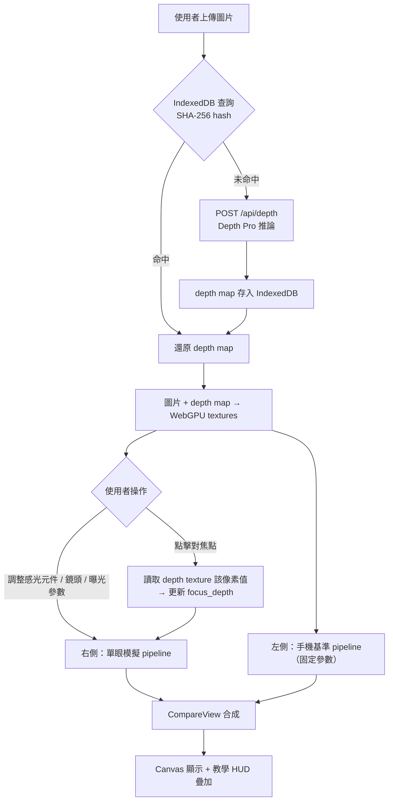
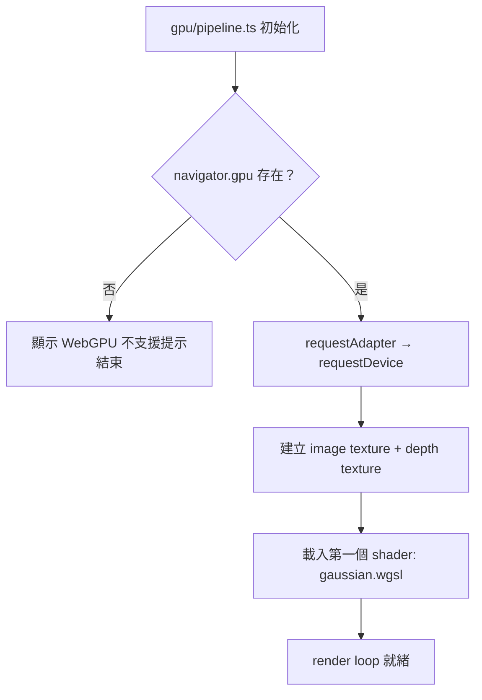
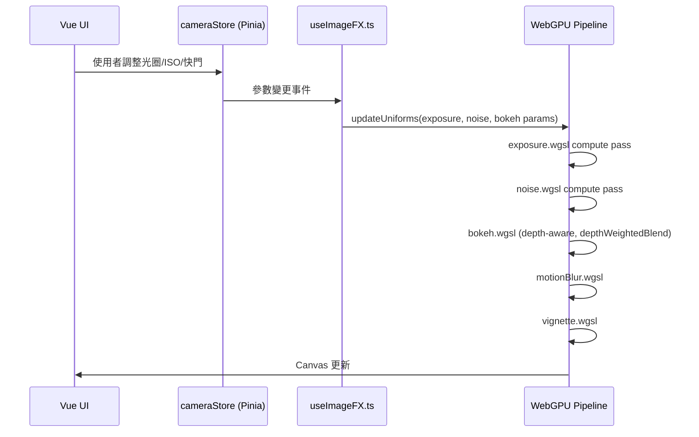
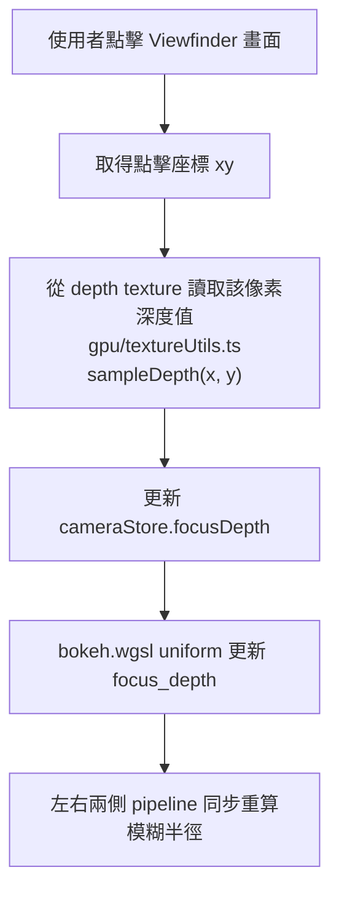
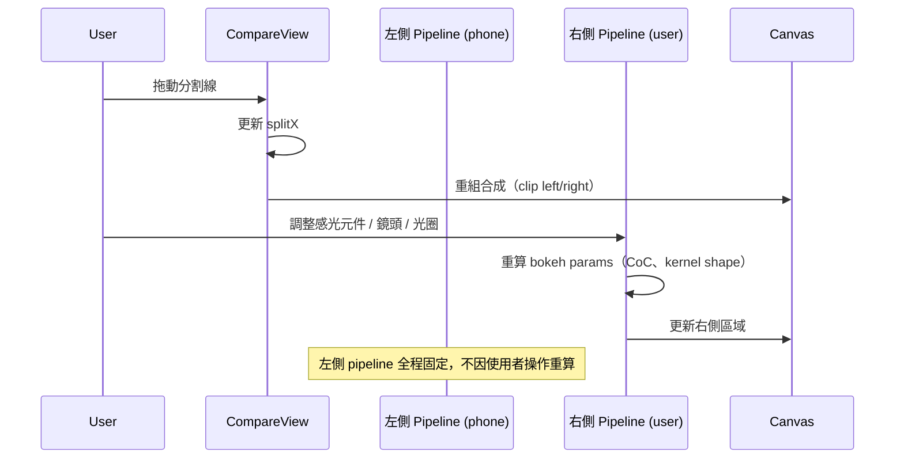

# Software Design Document: CamSim

> Iterative SDD — Each phase builds on the previous one. Implement in order.

---

## Table of Contents

1. [Project Overview](#1-project-overview)
   - [1.1 Overall Execution Flow](#11-overall-execution-flow)
2. [Phase 1: Core Pipeline](#2-phase-1-core-pipeline)
3. [Phase 2: Image Effects Engine](#3-phase-2-image-effects-engine)
   - [3.5 Shader Pipeline Sequence](#35-shader-pipeline-sequence)
4. [Phase 3: Killer Feature × Camera UI](#4-phase-3-killer-feature--camera-ui)
   - [4.5 Compare Mode Sequence](#45-compare-mode-sequence)
5. [Phase 4: Polish](#5-phase-4-polish)
6. [Risks & Notes](#6-risks--notes)

---

## 1. Project Overview

**Goal**: 讓使用者上傳一張照片，即時對比「手機拍攝效果」與「指定單眼相機參數（感光元件 + 鏡頭 + 曝光三角）的模擬效果」，搭配參數教學 HUD，使使用者直觀理解各光學參數的物理影響。

**Constraints**:
- 本地全端部署，圖片不上傳至外部服務
- 深度估計僅執行一次（per 圖片），後續全走前端 WebGPU
- 目標瀏覽器：Chrome 113+（WebGPU 原生支援）
- 後端 GPU：NVIDIA GTX 1650 Ti 4GB（VRAM 最低測試環境）
- 前端：Vue 3 + VitePlus（vp）；後端：Python 3.12 + uv + FastAPI

### 1.1 Overall Execution Flow



---

## 2. Phase 1: Core Pipeline

### 2.1 Requirements

- FastAPI 後端：接收圖片、執行 Depth Pro 推論、回傳 depth map
- 前端：圖片上傳 UI、WebGPU 初始化、depth map → GPU texture
- IndexedDB 快取：相同圖片不重複呼叫後端
- 第一個 shader：純 Gaussian blur 驗證管道通暢

### 2.2 API Contract

`POST /api/depth`

```
Request:  multipart/form-data  { file: image (JPEG/PNG/WebP, max 20MB) }
Response: {
  depth_map:        string   // base64 encoded 16-bit PNG
  focal_length_px:  number   // Depth Pro 推算焦距（像素單位）
  width:            number
  height:           number
  inference_ms:     number
}
```

`GET /api/health`

```
Response: { status: "ok", model_loaded: boolean, device: string, vram_used_mb: number }
```

### 2.3 IndexedDB 快取結構

| Key | Value |
|---|---|
| `depthCache:{sha256}` | `{ depthMapPng: ArrayBuffer, focalLengthPx: number, width: number, height: number }` |

快取於 `useDepthMap.ts` 管理，上傳前先計算 SHA-256，命中則跳過後端請求。

### 2.4 WebGPU 初始化流程



### 2.5 VRAM 管理規則

- 同時只保留當前圖片的 depth texture
- 使用者切換圖片時，舊 texture 顯式呼叫 `.destroy()`
- `GET /api/health` 的 `vram_used_mb` 供開發期監控

---

## 3. Phase 2: Image Effects Engine

### 3.1 Requirements

- 實作所有 WGSL compute shader（exposure、noise、bokeh、motionBlur、vignette）
- 曝光計算邏輯與拍攝模式（M / A / S / P）
- 感光元件系統（CoC、crop factor、noise curve）
- 即時直方圖

### 3.2 Shader Pipeline 順序

```
exposure → noise → bokeh (depth-aware) → motionBlur → vignette → chromAberr
```

每個 pass 的 input/output 為 `GPUTexture`（`rgba16float`），通過 compute shader 寫入下一張 texture。

### 3.3 感光元件資料結構（`data/sensors.ts`）

```ts
interface SensorProfile {
  id: string              // 'ff' | 'apsc_sony' | 'apsc_canon' | 'm43' | '1inch' | 'phone'
  label: string           // 顯示名稱
  cropFactor: number      // 相對全幅的 crop factor
  cocMm: number           // Circle of Confusion (mm)
  noiseCurveCoeff: number // ISO noise 強度係數（phone 值最高）
  chrominanceNoiseBias: number // chrominance noise 偏移量
}
```

| id | cropFactor | cocMm |
|---|---|---|
| `ff` | 1.0 | 0.030 |
| `apsc_sony` | 1.5 | 0.020 |
| `apsc_canon` | 1.6 | 0.019 |
| `m43` | 2.0 | 0.015 |
| `1inch` | 2.7 | 0.011 |
| `phone` | 4.8 | 0.006 |

### 3.4 拍攝模式邏輯（`useCamera.ts`）

| 模式 | 使用者控制 | 自動計算 |
|---|---|---|
| M（手動） | 光圈、快門、ISO | — |
| A（光圈優先） | 光圈、ISO | 快門（對應目標 EV） |
| S（快門優先） | 快門、ISO | 光圈（對應目標 EV） |
| P（程序） | — | 光圈 + 快門（按場景亮度自動配對） |

曝光公式：`EV = log2(N²/t) - log2(ISO/100)`

### 3.5 Shader Pipeline Sequence



---

## 4. Phase 3: Killer Feature × Camera UI

### 4.1 Requirements

- `CompareView`：左右分割畫面（手機基準 vs 單眼模擬），分割線可拖動
- 感光元件選擇（`SensorSelector`）+ 鏡頭選擇（`LensSelector`）
- 對焦點點擊選取
- 參數教學 HUD
- 擬真相機 UI（轉盤、觀景窗）

### 4.2 Compare Mode 雙 Pipeline

兩條 pipeline 共用同一份 depth texture 和 image texture，參數各自獨立：

| | 左側（手機基準） | 右側（單眼模擬） |
|---|---|---|
| 感光元件 | `phone`（固定） | 使用者選擇 |
| 光圈 | f/1.8（等效 f/8.6） | 使用者設定 |
| 焦距 | 等效 26mm（固定） | 使用者設定 |
| ISO noise curve | phone 係數 | sensor-aware 係數 |
| 後處理 | 關閉 | 完整 pipeline |

`useCompare.ts` 管理：分割線 X 座標（`splitX: number`，0–1）、手機基準固定參數物件。

### 4.3 鏡頭資料結構（`data/lenses.ts`）

```ts
interface LensProfile {
  id: string
  name: string              // 顯示名稱
  focalLength: number       // 焦距 (mm)
  maxAperture: number       // 最大光圈 f-number
  blades: number            // 光圈葉片數
  bokehShape: 'circle' | 'polygon' | 'swirl'
  swirlStrength?: number    // 0–1，僅 swirl 類型
  vignetteProfile: number   // 暗角強度係數 0–1
  chromaProfile: number     // 色差強度係數 0–1
  characterNote: string     // 教學 HUD 顯示文字
}
```

內建鏡頭：Zeiss Otus 55mm f/1.4、Canon EF 85mm f/1.2L、Helios 44-2 58mm f/2、Nikkor 50mm f/1.8G

### 4.4 對焦點選擇邏輯



### 4.5 Compare Mode Sequence



### 4.6 教學 HUD 內容規則

每個參數的說明文字在 `data/lenses.ts` / `data/sensors.ts` 中定義，顯示規則：

| 觸發條件 | HUD 顯示內容 |
|---|---|
| 調整光圈 | 目前景深範圍估算（公尺）+ 等效全幅光圈（若非 FF 感光元件） |
| 調整 ISO | 當前感光元件在此 ISO 的訊雜比估算（dB） |
| 調整快門 | 動態模糊起始閾值（依目前焦距換算安全快門） |
| 選擇鏡頭 | `LensProfile.characterNote` |
| 選擇感光元件 | 等效焦距換算結果 + CoC 數值 |

---

## 5. Phase 4: Polish

### 5.1 Requirements

- `chromAberr.wgsl`：邊緣 RGB 通道偏移，強度由鏡頭 `chromaProfile` 決定
- 焦段 FOV 計算：`fov = 2 × atan(sensor_diagonal / (2 × focal_length))`，連動 crop factor 做透視裁切
- 導出處理後照片（Canvas `toBlob` → 下載）
- 鍵盤快捷鍵（`←` / `→` 微調當前選中參數）
- 快門音效（機械 / 電子切換）
- 模式轉盤動畫

### 5.2 FOV 裁切邏輯

```
sensor_diagonal = sqrt(sensor_width² + sensor_height²)  // 單位 mm
fov_rad = 2 × atan(sensor_diagonal / (2 × focal_length))
crop_scale = tan(reference_fov / 2) / tan(fov_rad / 2)  // 相對標準視角的縮放比
```

在 `exposure.wgsl` pass 中套用 UV 偏移實現 FOV 裁切（不額外增加 pass）。

---

## 6. Risks & Notes

### 6.1 技術風險

| 風險 | 說明 |
|---|---|
| Depth Pro 在 Windows + CUDA 的相容性 | 官方主要測試 Linux + Apple Silicon；Windows 環境需社群安裝指引，安裝失敗率較高 |
| GTX 1650 Ti VRAM 不足（4GB） | Depth Pro 約佔 2.5GB，depth texture + image texture 需嚴格管理，切換圖片必須先 `.destroy()` |
| WebGPU bokeh 卷積效能 | 大 kernel size（f/1.2 + 遠景）在低階 GPU 上可能掉幀；需實作自適應 kernel size 上限 |
| Three.js TSL 穩定性 | TSL 仍在快速迭代，API 可能在次版本異動；bokeh polygon 幾何計算部分需設隔離層，便於替換為純 WGSL |
| NumPy 2.x API 異動 | 固定 `~2.1`，升級前需驗證 PyTorch + Pillow 相容性 |

### 6.2 建議實作順序

```
Phase 1 → 驗證 depth map pipeline 通暢（能看到分層模糊）
Phase 2 → 驗證所有 shader 視覺正確，感光元件切換有景深差異
Phase 3 → 驗證 CompareView 左右視覺差異明顯，教學 HUD 說明準確
Phase 4 → 驗證 FOV 裁切視角正確，導出圖片品質可接受
```

### 6.3 關鍵參數邊界值

| 參數 | Min | Max | 說明 |
|---|---|---|---|
| 光圈 | f/1.0 | f/22 | f/1.0 以下無現實鏡頭參考，不支援 |
| 快門 | 1/4000s | 30s + B | B 門為無限時間，motion blur 設最大值 |
| ISO | 50 | 102400 | 超過 6400 noise 係數指數成長 |
| 焦距 | 14mm | 600mm | 超望遠 FOV 裁切會使解析度嚴重降低 |
| 對焦距離 | 0.3m | ∞ | ∞ 對應 depth texture 最遠層 |
| Bokeh kernel size | 1px | 64px | 超過 64px 在 GTX 1650 Ti 上掉幀 |
