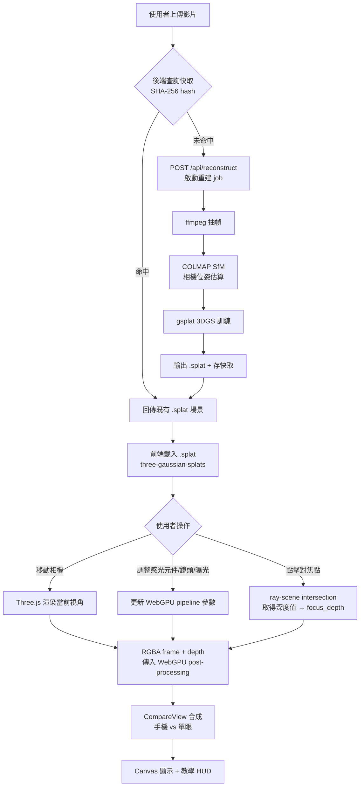
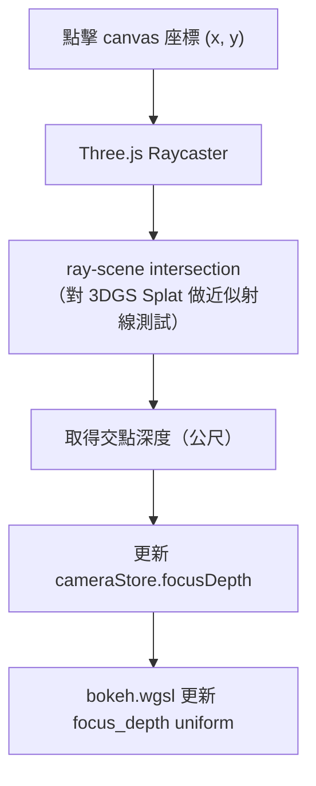
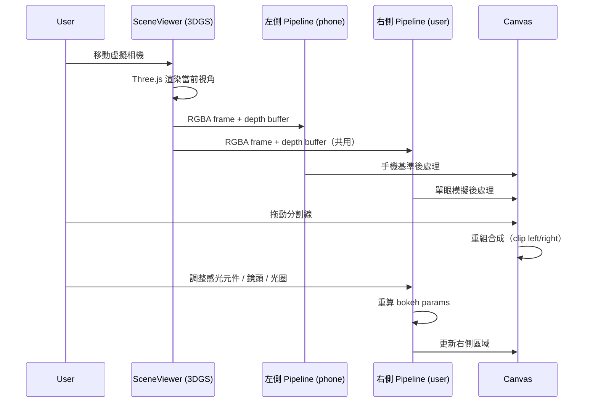

# Software Design Document: CamSim (3D Interactive)

> 分支 `3d-interactive`：3D Gaussian Splatting + 虛擬相機漫遊版本。
> 相機 UI / 感光元件 / 鏡頭 / WGSL shader 沿用 main 分支，本文件著重描述差異部分。

---

## Table of Contents

1. [Project Overview](#1-project-overview)
2. [3D Reconstruction Pipeline](#2-3d-reconstruction-pipeline)
3. [Frontend 3D Scene Rendering](#3-frontend-3d-scene-rendering)
4. [Camera Effects Integration](#4-camera-effects-integration)
5. [Compare Mode](#5-compare-mode)
6. [Risks & Notes](#6-risks--notes)

---

## 1. Project Overview

**Goal**：使用者上傳一段多視角影片，後端重建 3D Gaussian Splatting 場景。前端載入場景後，使用者可自由移動虛擬相機位置，選擇感光元件與鏡頭，即時對比「手機效果」vs「單眼效果」。

**Constraints**:
- 本地全端部署，影片 / 場景資料不上傳至外部服務
- 3DGS 重建僅執行一次（per 影片），結果快取於後端
- 即時渲染和效果模擬全在前端 GPU（Three.js + WebGPU）
- 目標瀏覽器：Chrome 113+（WebGPU 原生支援）
- 後端 GPU：NVIDIA GTX 1650 Ti 4GB（最低測試環境）

### 1.1 Overall Execution Flow



---

## 2. 3D Reconstruction Pipeline

### 2.1 Job 架構

重建流程為非同步長時間任務，使用 FastAPI BackgroundTasks 管理：

```python
# 重建 job 狀態
class JobStatus(Enum):
    QUEUED = "queued"
    EXTRACTING = "extracting"   # ffmpeg 抽幀
    SFM = "sfm"                 # COLMAP SfM
    TRAINING = "training"       # gsplat 3DGS 訓練
    DONE = "done"
    ERROR = "error"

class ReconstructJob:
    job_id: str          # UUID
    video_hash: str      # SHA-256
    status: JobStatus
    progress: float      # 0.0 – 1.0（訓練 iteration 進度）
    splat_path: str | None
    error: str | None
```

### 2.2 重建步驟

**Step 1：影片抽幀（ffmpeg）**

```bash
ffmpeg -i input.mp4 -vf fps=2 -q:v 2 frames/%04d.jpg
```

- 預設 2fps 抽幀，確保相鄰幀間有足夠重疊（~70% overlap 為 COLMAP 最佳）
- 最多抽 300 幀（避免 COLMAP 過慢）
- 幀解析度降至 1280px 長邊（加速 SfM）

**Step 2：COLMAP SfM**

```
feature_extractor → exhaustive_matcher → mapper → model_converter
```

輸出：`sparse/0/` 內的 `cameras.bin / images.bin / points3D.bin`（轉成 TXT 格式供 gsplat 讀取）

**Step 3：gsplat 3DGS 訓練**

```python
from gsplat import rasterization

# 訓練配置
trainer = GaussianTrainer(
    data_dir="colmap_output/",
    max_steps=7000,          # 快速重建用 7000，精細用 30000
    strategy="default",
)
trainer.train()
trainer.export_splat("scene.splat")
```

### 2.3 快取策略

```
backend/scenes/
└── {video_sha256}/
    ├── scene.splat         # 主要輸出（供前端下載）
    ├── colmap/             # COLMAP 中間結果
    └── meta.json           # 重建時間、幀數、訓練 steps 等 metadata
```

若 `{video_sha256}/scene.splat` 存在，直接跳過重建回傳檔案路徑。

---

## 3. Frontend 3D Scene Rendering

### 3.1 SceneViewer 元件

使用 GaussianSplats3D（three-gaussian-splats）渲染 .splat：

```ts
import { Viewer as SplatViewer } from "@mkkellogg/gaussian-splats-3d";

const viewer = new SplatViewer({
  renderer: threeRenderer,
  camera: perspectiveCamera,
  gpuAcceleratedSort: true,
});
await viewer.addSplatScene(splatUrl);
viewer.start();
```

渲染迴圈每幀：
1. Three.js 渲染至 `WebGLRenderTarget`
2. 讀出 RGBA texture + depth buffer
3. 傳入 WebGPU post-processing pipeline

### 3.2 相機控制模式

| 模式 | 操作 | 適用場景 |
|---|---|---|
| Orbit | 滑鼠拖動旋轉、滾輪縮放、右鍵平移 | 靜態場景觀察 |
| FPS | WASD 移動、滑鼠看方向（pointer lock） | 場景內部漫遊 |

`useScene.ts` 管理：當前模式、相機 position/quaternion、目標焦點。

### 3.3 深度取樣

使用者點擊畫面對焦時：



3DGS 沒有傳統 mesh 幾何，近似方式為：從 depth buffer 讀取點擊位置的深度值，再反投影為世界座標距離。

---

## 4. Camera Effects Integration

### 4.1 Shader Pipeline（沿用 main 分支）

```
3DGS 渲染幀 (RGBA, WebGL canvas)
    ↓ copyExternalImageToTexture (per-frame, ~1ms)
WebGPU rgba8unorm texture
    ↓
exposure → noise → bokeh → motionBlur → vignette → blit
    ↓
WebGPU canvas（疊在 GS3D canvas 之上）
```

由 `useEffects.ts` 驅動，每個 RAF tick 抓 GS3D 的 WebGL canvas frame 灌進 `CamSimPipeline.uploadFrame()`，
取代舊的「載入靜態 File」流程。

### 4.2 Texture 橋接（採方案 A — per-frame canvas readback）

WebGL 與 WebGPU 屬於不同 GPU context，texture 無法直接共用。實作上：

```ts
// 每 frame：把 GS3D 的 WebGL canvas 當外部影像來源
device.queue.copyExternalImageToTexture(
  { source: gs3dCanvas },
  { texture: imageTexture },
  [width, height],
);
```

`copyExternalImageToTexture` 在現代 GPU 約 0.5–2 ms（1080p），對 30 FPS 目標可接受。
較高效能的方案 B（共用 WebGPU renderer + GPU texture import）等 Three.js WebGPU renderer 穩定後再評估。

### 4.3 Depth 來源（已知限制）

`@mkkellogg/gaussian-splats-3d` 不對外輸出 per-pixel depth buffer。
本 phase 採用務實的近似策略：

- **對焦點深度**：點擊 canvas 時用 `THREE.Raycaster` 對 `splatMesh` 投射射線，
  取交點到相機距離（單位：公尺）寫進 `cameraStore.focusDepth`。
- **Bokeh depth uniform**：以「相機到對焦點距離」當作整幀均勻深度。
  shader 中 `|center_depth - focus_depth| ≈ 0`，因此 bokeh radius 近乎 0
  → 散景在此模式下「對焦範圍內全清晰，超出就一致模糊」，**不是真正的景深分層**。

要恢復 main 分支那種精準景深，需要 fork GS3D 多輸出一個 depth attachment（見 roadmap Phase 4）。

### 4.3 雙 Pipeline 參數

| | 左側（手機基準） | 右側（單眼模擬） |
|---|---|---|
| 渲染幀 | 共用同一 3DGS 渲染幀（相同視角） | 同上 |
| 感光元件 | `phone`（固定） | 使用者選擇 |
| 光圈 | f/1.8（等效 f/8.6） | 使用者設定 |
| ISO noise curve | phone 係數 | sensor-aware 係數 |
| 後處理 | 簡化版（無 chromAberr / motionBlur） | 完整 pipeline |

---

## 5. Compare Mode

### 5.1 Compare Mode Sequence



### 5.2 焦點同步

點擊對焦後，`focus_depth` 同步更新左右兩側 pipeline。左側手機基準的 CoC 維持 phone 值，但焦平面位置與右側相同。

---

## 6. Risks & Notes

### 6.1 技術風險

| 風險 | 說明 | 緩解策略 |
|---|---|---|
| COLMAP SfM 失敗率 | 影片移動太快、光線不足、重疊不夠時 SfM 可能失敗 | 回傳明確錯誤訊息 + 建議重拍指引 |
| 3DGS 訓練時間 | GTX 1650 Ti 上 7000 steps 約 10–20 分鐘 | 進度條 + SSE 即時回報；快取避免重複訓練 |
| .splat 檔案過大 | 複雜場景 .splat 可達 500MB+ | 訓練時限制 Gaussian 數量；前端串流載入 |
| depth buffer 精度 | Three.js depth buffer 在遠景精度下降（logarithmic depth buffer 可改善） | 對焦距離 clamp 至合理範圍，遠景設最大 DoF |
| Three.js ↔ WebGPU texture 橋接 | WebGL 和 WebGPU context 無法直接共用 texture | 使用 canvas readPixels 或 WebGPU import WebGL texture extension |
| GTX 1650 Ti VRAM | 3DGS 訓練約佔 3–4GB；前端渲染 + WebGPU post-processing 另需 1–2GB | 後端訓練完成後清除中間 GPU 佔用；前端渲染和訓練不同時進行 |

### 6.2 Three.js ↔ WebGPU Texture 橋接方案

**方案 A（優先嘗試）**：`WEBGL_multi_draw` + canvas 中轉
```
Three.js 渲染 → offscreen canvas → createImageBitmap → WebGPU copyExternalImageToTexture
```
缺點：每幀 CPU 回讀，有延遲（~1–2ms）。

**方案 B（最佳效能）**：使用 WebGPU renderer 替代 WebGL renderer，three-gaussian-splats 切換至 WebGPU 路徑，texture 原生共用。Three.js r168+ WebGPU renderer 仍在 beta，穩定性需評估。

### 6.3 建議實作順序

```
Phase 1 → 驗證後端 COLMAP + gsplat pipeline（能輸出可用 .splat）
Phase 2 → 驗證前端 three-gaussian-splats 渲染（能在場景中移動）
Phase 3 → 驗證 WebGPU post-processing 接入（bokeh 效果正確）
Phase 4 → 驗證 CompareView（手機 vs 單眼差異明顯）
```

### 6.4 影片拍攝建議（使用者指引）

| 場景類型 | 建議拍攝方式 |
|---|---|
| 室內小場景 | 繞物體一圈，維持 50–70% 幀間重疊 |
| 室外建築 | 水平弧形移動，保持建築物始終在畫面中 |
| 不適合 | 純旋轉（原地轉圈）、移動太快、光線不足 |
